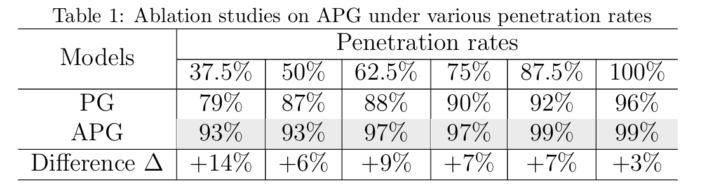
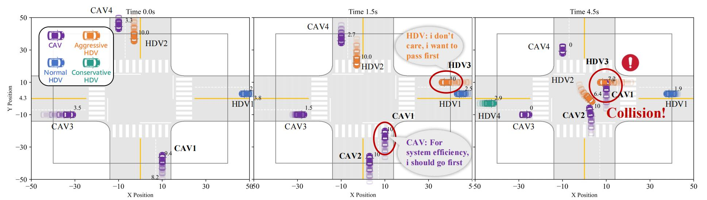
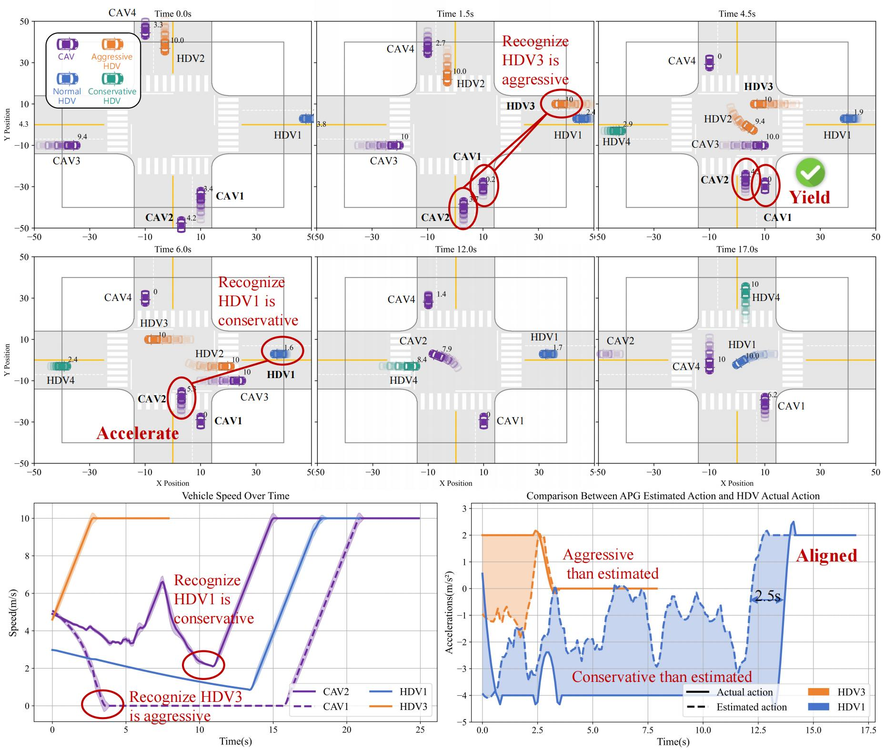
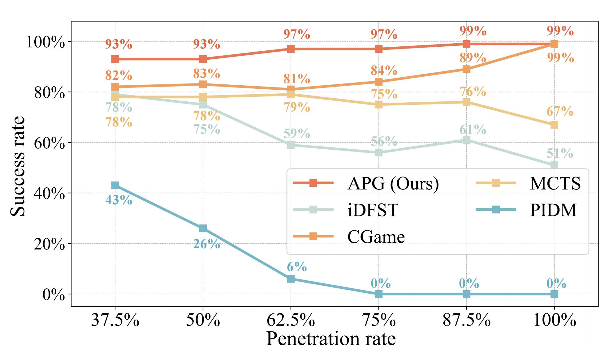
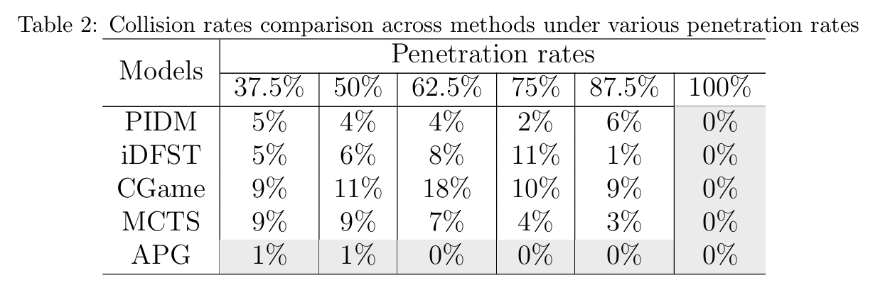
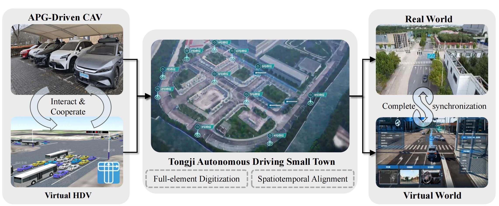
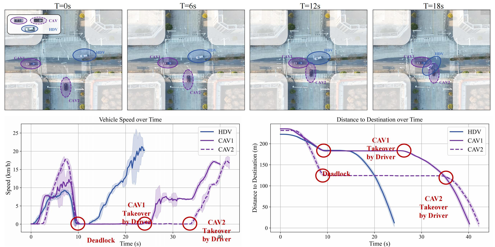
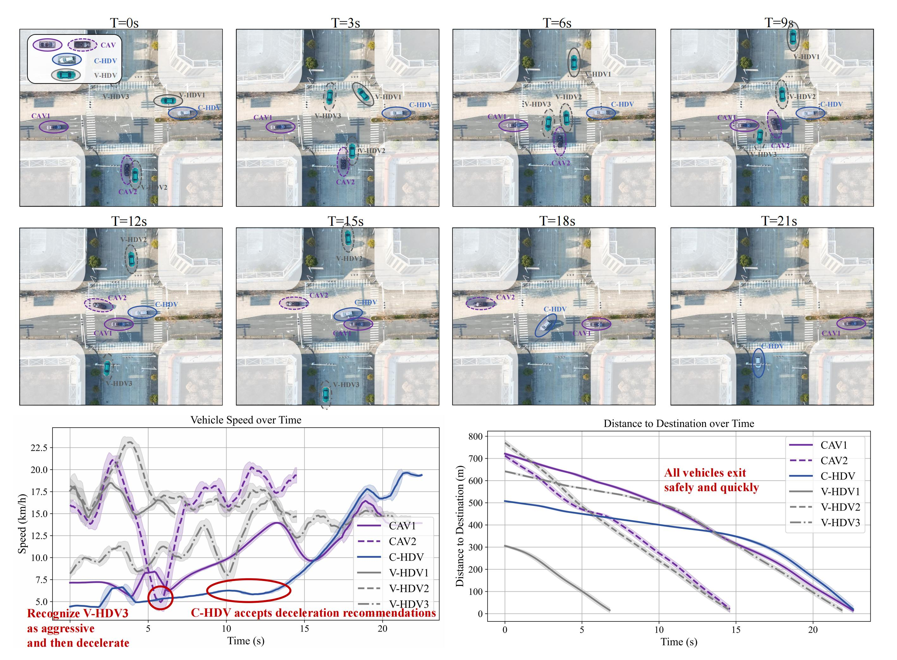

# Towards Cooperative Driving in Mixed-Traffic: An Adaptive Potential Game-Based Approach with Field Test Verification

**[Shiyu Fang](https://fangshiyuu.github.io/)**, [Peng Hang](https://tops.tongji.edu.cn/info/1031/1383.htm), [Jian Sun](https://tops.tongji.edu.cn/info/1031/1187.htm)  

[Department of Traffic Engineering and Key Laboratory of Road and Traffic Engineering, Ministry of Education, Tongji University](https://tops.tongji.edu.cn/)  

## Abstract

Connected autonomous vehicles (CAVs), representing a significant advancement in autonomous driving technology, have the potential to greatly enhance traffic safety and efficiency through cooperative decision-making. However, existing methods often overlook the individual needs and heterogeneity of cooperation participants, making it difficult to transfer to environments where they coexist with Human-Driven Vehicles (HDVs).
To address this challenge, this paper proposes an Adaptive Potential Game (APG) cooperative driving framework. First, the system utility function is established based on a general form of individual utility and its monotonic relationship, allowing for the simultaneous optimization of both individual and system objectives.  Second, the Shapley value is introduced to compute each vehicle’s marginal utility within the system, allowing its varying impact to be quantified. Finally, HDV preference estimation is dynamically refined by continuously comparing observed HDV behavior with APG’s estimated actions, leading to improvements in overall system safety and efficiency. 
Ablation studies demonstrate that adaptively updating Shapley values and HDV preference estimation significantly improve cooperation success rates in mixed traffic. Comparative experiments further highlight APG’s advantages in safety and efficiency over other cooperative methods. Moreover, the approach’s applicability to real-world scenarios was validated through field tests.

## Challenges
Two fundamental limitations hinder current CAV frameworks in hybrid traffic. *System-Individual Decision Conflict*: While cooperative systems prioritize global objectives like traffic throughput, individual vehicles balance safety, comfort, and efficiency, leading to inherent conflicts between system-wide and individual decision-making perspectives. Studies have shown that rigid system-centric optimization, which overlooks individual needs, can lead to a 5% increase in accidents in mixed-autonomy environments, as HDVs resist sacrificing their preferences for collective gains. *Cooperation Participants Heterogeneity*: Cooperative models often assume HDVs are homogeneous, overlooking behavioral diversity driven by individual decision preferences and the unsymmetrical impact on the system caused by varying conflict relationships. As a result, when faced with real-world diverse driving styles and complex conflict topologies, cooperative strategies may become suboptimal. In some cases, introducing CAVs can unintentionally increase, rather than reduce, overall traffic inefficiency. In summary, the most pressing challenges in cooperative driving lie in optimizing system-level performance while ensuring individual equilibrium, and in real-time quantification and adaptation of cooperative strategies based on the diverse characteristics of participants.


## Solutions

To address this issue, this paper proposes an APG cooperative decision-making framework, as illustrated below. Constructing a system utility function that accommodates diverse individual needs is crucial for enhancing the applicability of cooperative methods in mixed-traffic environments. To this end, this paper starts from a general formulation of individual utility and, by establishing an equal potential relationship between individual and system utilities, the system utility function is derived from the bottom up. Under this design, when the system utility reaches its optimum, no cooperative participant can unilaterally alter their behavior to gain additional benefit, thereby achieving a game-theoretic equilibrium among individuals. In other words, the simultaneous optimization of individual and system utilities is achieved.

Furthermore, this paper decomposes individual heterogeneity into two key aspects: the unsymmetrical impact on the system and the diversity of behavioral preferences. These characteristics are represented by two distinct sets of weights. The Shapley value is used to quantify each vehicle’s contribution by calculating its marginal utility, reflecting its relative impact on the system. In addition, the decision preference estimation for HDVs is continuously refined through a back-propagation approach that compares the optimal cooperative actions generated by APG with the observed behaviors of HDVs. This alignment gradually improves the consistency between theoretical optimal action and observed actions, thereby enhancing the safety and efficiency of the cooperative system.


## Experiments
To validate the effectiveness of the proposed APG framework, we first conduct an ablation study to compare success rates with and without adaptive updates under various penetration rates. We then benchmark its performance against other representative cooperative methods to demonstrate its advantages in safety and efficiency. Finally, we evaluate the framework through real-world vehicle tests in various scenarios at the Tongji Small Town (TJST).


### Ablation Studies on APG
In order to facilitate the reader to understand how the Shapley value is constantly changing in the process of cooperation, we use the shade of color to represent the value of the Shapley value. More specifically, the closer the color of the vehicle is to purple, the higher its Shapley value is at this moment. This indicates that the vehicle currently has a greater impact on the system. Conversely, lighter colors indicate weaker impacts on the system. Additionally, each car's normalized Shapley value is displayed next to it. The cooperation case shown in Fig.5 in the paper is shown below  



[]()

As shown in Table1, incorporating the adaptive weight method significantly improves the success rate across all penetration levels, with an average increase of 7.5% and a maximum improvement of 14%. Even at a 100% penetration rate—where no uncontrolled HDVs require real-time estimation updates—the success rate still rises by 3%. This improvement is primarily due to Shapley value-based optimization, which prioritizes vehicles with a greater impact on the cooperative system, thereby enhancing overall efficiency and reducing inefficiencies.

To further illustrate the effect of the adaptive weight method, we visualize a scenario with identical initial conditions. Fig.~\ref{fig: pg-ablation-without} depicts vehicle trajectories without adaptive weight updates. In this scenario, there are four CAVs, two aggressive HDVs, one normal HDV, and one conservative HDV. The number displayed in the upper right corner of each vehicle indicates its current speed.  



[]()

In this case, CAV1 had already crossed the stop line and entered the intersection when HDV3 arrived. To optimize overall efficiency, the system prioritized CAV1’s passage, allowing it to maintain a desired speed of 10ms. However, HDV3, driven by its preference to maximize personal efficiency, continued accelerating after entering the cooperative system, disregarding the broader system impact and ultimately causing a collision.

Furthermore, the Figure above illustrates the results after applying the adaptive weight method. In this case, CAV1 and CAV2 detected that HDV3 did not decelerate as initially estimated by APG but instead maintained a relatively high speed. According to back propagation method, the system updated its estimation, recognizing that HDV3 had a stronger preference for efficiency. Consequently, during the optimization process, priority was given to maximizing HDV3's speed, prompting CAV1 and CAV2, which were in potential conflict with HDV3, to slow down. 



[]()

Moreover, during the interaction, HDV1 consistently exhibited more conservative behavior than initially estimated, leading APG to prioritize CAV2’s acceleration to clear the intersection efficiently. A notable pattern emerges when comparing estimated and observed actions: between 11-13s and 13-15s, APG’s predicted trajectory for HDV1 remains nearly identical. This occurs because, from a system perspective, where vehicle behaviors are controllable, earlier acceleration improves overall efficiency. In contrast, from an individual perspective, where other vehicles’ actions are uncertain, HDV1 tends to delay acceleration until absolute safety is ensured. This finding reinforces that when HDVs adhere to APG’s optimal cooperative solutions, both system efficiency and individual performance improve. This will be further validated in the next field tests.

In summary, with the adaptive weight method, all vehicles successfully and efficiently navigated through the intersection without collisions.

### Comparison under different ROP

To further validate the effectiveness of the proposed APG in mixed-traffic cooperative scenarios, we compared it with several cooperative decision-making methods, including Projected-IDM (PIDM), iDFST, CGame, and Monte Carlo Tree Search (MCTS).

#### Overall Performance
The figure below illustrates the success rates of different methods, revealing two distinct trends. First, the success rates of PIDM, iDFST, and MCTS decline as penetration increases. A deeper analysis suggests that this is primarily due to a decrease in average efficiency at higher penetration levels, which will be discussed in detail later.



[]()

Here, we emphasize a counterintuitive observation: while it is commonly assumed that a higher proportion of CAVs should improve overall system performance, both real-world open-road data and our simulation results indicate the opposite. Instead of enhancing efficiency, current CAVs are often the main contributors to its decline, aligning with existing challenges in real-world deployments.


In contrast, CGame and APG exhibit a completely different trend, with success rates steadily increasing as penetration rises. This is mainly because game-theoretic methods are based on rational decision-making logic, making them more adaptable in mixed traffic environments. However, the success rate of CGame remains lower than that of APG due to its overly strong assumption that all cooperative participants will act collaboratively, neglecting the various preferences of real-world human drivers. We will further explore this issue in the Safety Evaluation section.

#### Safety Evaluation

The success rate reflects the overall performance of different methods. To further evaluate the proposed APG framework in terms of safety and efficiency, we introduce collision rate and delay as key metrics. Table2 presents the performance of various methods under different penetration rates.  

According to Table2, two key observations emerge from the results. First, the APG cooperative decision-making framework consistently achieves the lowest collision rate across all penetration levels. Notably, when the penetration rate exceeds 50%, the collision rate drops to zero. Second, at 100% penetration, the collision rate is zero for all methods. This result can be attributed to the absence of uncontrolled HDVs in the environment. Since all vehicles are CAVs following the same decision logic, ROW conflicts naturally do not occur.

Additionally, several other findings can be drawn from Table2. In terms of both average and maximum collision rates, CGame performs the worst, even falling behind rule-based methods like iDFST. This further validates our earlier assertion that most existing game-theoretic methods assume participants are either fully cooperative or entirely competitive. As a result, their performance deteriorates in the presence of HDVs with various preferences. Furthermore, it highlights the rationale behind the proposed APG’s approach, which avoids making explicit assumptions about participants and instead seeks the equilibrium between the individual and the system. These results also indicate that APG better aligns with HDV decision-making logic and is more suitable for mixed-traffic environments.



[]()

#### Efficiency Evaluation

Delay is a key indicator of driving efficiency. The figure below illustrates the average delay performance of different methods across various penetration rates. It is evident that the proposed APG framework consistently achieves the lowest delay at all penetration levels. Notably, at 100% penetration, the delay is only 7.6s, with cooperative participants rarely needing to decelerate to a full stop. This demonstrates that incorporating individual utility into the modeling of system utility significantly enhances both individual and system-wide efficiency. Additionally, in CGame, as penetration increases, more vehicles participate in cooperation, leading to a reduction in average delay. 

In contrast, PIDM, iDFST, and MCTS exhibit an entirely opposite trend in efficiency, where performance declines as penetration increases. At first glance, this seems contradictory to previous studies, but we find that most prior research used IDM as the background traffic model. This overly rigid design effectively forced HDVs to operate in a first-come, first-served manner, deviating significantly from real-world driving behavior. Consequently, when these methods are applied to environments with various HDVs, their performance trends differ drastically.


[]()

In summary, a comprehensive comparison of APG with other methods in terms of safety and efficiency shows that APG consistently outperforms other approaches across all penetration rates. This superiority primarily stems from its design, which does not impose assumptions on participant behavior. Instead, APG derives system utility step by step from a general formulation of individual utility. By leveraging the monotonic relationship between individual and system utility, it simultaneously achieves a balanced optimization, making it particularly suitable for mixed-traffic environments.

### Real World Field Test
Finally, to verify the feasibility of applying the proposed method in real-world autonomous driving systems, we conducted experiments in multiple scenarios at TJST using a virtual-reality testing system. The main workflow of the testing system is illustrated below. By mapping APG-driven real-field CAVs and virtual HDVs into the same digital space, real-time interaction and cooperation were achieved.



[]()

To demonstrate the capability of the proposed cooperative decision-making framework in enhancing the performance of existing autonomous driving systems, we first designed a relatively simple scenario involving two CAVs and one HDV. In this case, the CAVs were controlled by the decision-making algorithm of a specific autonomous driving startup, while the HDV was operated by an experienced human driver. The initial positions and vehicle trajectories are shown below.

Additionally, we plotted speed versus time and the distance to destination versus time for all vehicles. The data shows that all three vehicles continuously accelerated during the first 8s. Around the 10s mark, their close proximity led to abrupt braking, resulting in a deadlock. Shortly after, the HDV driver accelerated and exited the intersection first, while CAV1 and CAV2 remained stationary. Eventually, at approximately 24s and 35s, the safety drivers of CAV1 and CAV2 had to manually intervene to clear the intersection. This case highlights the challenges faced by current CAVs when dealing with multi-vehicle conflict scenarios in mixed traffic. 



[]()

<video muted controls width=600> <source src="./src/intersection.mp4"  type="video/mp4"> </video>

In contrast, the proposed APG cooperative decision-making method effectively addresses this challenge and remains robust in more complex scenarios. To further validate its effectiveness, we introduced three additional virtual HDVs (V-HDV) into the scenario shown below. Additionally, we equipped HDVs with onboard units (OBUs) to facilitate communication with CAVs and receive the optimal cooperative solutions generated by APG in real time. However, human drivers were not required to follow APG's suggested actions.

During the first 3s of interaction, the system prioritizes overall efficiency by considering factors such as lane position and distance to the intersection. As a result, it is optimal for CAV2, V-HDV2, and V-HDV1 to pass first, leading to a higher acceleration for CAV2, while CAV1 and Connected HDV (C-HDV) receive lower acceleration values. However, the uncontrolled V-HDV3 does not recognize this strategy and continues to accelerate. After updating its preference estimation, the system identifies V-HDV3 is aggressive and intend to pass first. To prevent a collision, it adjusts the strategy by instructing CAV2 to decelerate until V-HDV3 clears the conflict point.  

Subsequently, CAV2 sequentially passes the conflict points with CAV1 and C-HDV, with both vehicles accelerating in turn until they exit the intersection. During this process, the driver of the C-HDV confidently considers accelerating at the 2s mark. However, after just 1s, they quickly notice several vehicles approaching the intersection at high speeds, prompting a reevaluation of their decision. As a result, the driver opts to follow the APG-recommended speed instead.



[]()

A comparison between two figures shows that the proposed APG cooperative decision-making framework effectively handles various HDVs in mixed-traffic environments. By leveraging vehicle connectivity, it can transmit optimal cooperative actions to HDVs, guiding them from pursuing individual utility to achieving system-wide optimization, thereby demonstrating its applicability and superiority in real-world scenarios.
 
The videos demonstrating the actual operation encompass various perspectives, including an aerial view, the interior view of the main vehicle, the virtual twin interface, and the interior Human-Machine Interface (HMI) view. These are presented below:
<video muted controls width=600> <source src="./src/intersection.mp4"  type="video/mp4"> </video>

Furthermore, we also tested the performance of the proposed APG in other scenarios such as roundabouts. The video of the actual operation is as follows.

| <video muted controls width=380> <source src="./src/turn.mp4"  type="video/mp4"> </video> <video muted controls width=380> <source src="./src/roundabout.mp4"  type="video/mp4"> </video> |


## Citation
```
@misc{,
      title={}, 
      author={},
      year={2023},
      eprint={},
      archivePrefix={arXiv},
      primaryClass={cs.MA}
}
```

## Appendix

### 1.Modeling Heterogeneous HDV
Despite the uncertainty due to the absence of traffic lights, unpredictable and uncontrollable HV latent intention of decision may lead to even greater strait for CAVs. In order to validate the cooperative driving algorithm of CAVs in heterogeneous mixed traffic. In this section, sophisticated real-world drivers' demonstrations were extracted for reproducing heterogeneous HV decisions. 

The main process consists of four steps. Firstly, interaction data from a real-world intersection were collected. Secondly, drivers' decisions were classified into three groups by K-means cluster. Then, non-cooperative game, known as a promising model to reproduce the process of human decision making, was selected to guide the generation of HVs' decision. Finally, the decision-making preference of each group was calibrated through IRL. 

#### Drivers' Decisions Classification by K-means Cluster
In order to reproduce drivers with different decision-making preferences. The first priority was to determine how many decision clusters the drivers at the intersection of XXJH can be divided into. Based on the result of the elbow method, a simple but versatile theory to determine the number of clusters using the Sum of Squared Errors (SSE), three clusters work best for our data. Considering that speed and acceleration are the most intuitive manifestation of decision making during driving, the average, maximum, minimum, and standard deviation of speed and acceleration of vehicles were taken as the clustering parameters}. K-means clustering was then used to classify naturalistic human driving data samples in XXJH.

After the clustering algorithm converged, the drivers' decisions in XXJH were divided into three clusters. Furthermore, their trajectories were used as expert demonstrations and then compared with HDVs' feasible trajectories to calibrate different decision-making preferences. In this paper, a non-cooperative game was chosen to estimate possible decisions human may adopt when confronted with other drivers because it achieves more realistic human behavior when performing conflicting maneuvers at intersections. Together with vehicle dynamics, feasible trajectories of each frame can be concluded.

#### HDVs' Feasible Trajectories Generation through Non-cooperative Game
As mentioned before, game theory describes human as a rational decision-maker who takes action dependencies into account. Hence, there is a growing application in the field of modeling human decision. In this paper, we regard human drivers as rational decision-makers and are aware of the consequence that their actions will influence other drivers who have conflict with them in temporal and spatial dimensions. Non-cooperative game was therefore established to mimic how drivers conjecture and compete with each other while driving in sharing space. We considered a sampling interval, $\Delta t=0.1s$, and an action set including six strategies that represent common driving maneuvers in urban traffic is listed below. 

Table. Action set


[]()


#### Decision-making Preference Calibration by IRL
After dividing drivers into groups and generating feasible trajectories through non-cooperative game. IRL was introduced to excavate inherent characteristics that influence the expert decision. IRL was proposed later than behavior cloning. Though they share many similarities. Differing from simply imitating expert maneuvers, IRL tries to infer the reason why experts make their decision and then optimize the strategy. In other words, except directly learning the state-action mapping, IRL infers the form of reward weight and optimizes maneuvers through it. The pseudocode of maximum entropy IRL is summarized in Algorithm.1.


[]()

After training, the reward weights of different driver groups can be calibrated through maximizing entropy and iterating, as shown below.

Table. IRL Calibration Results


[]()

Table exhibits the calibration results of IRL where drivers are divided into three clusters through K-means clustering. Among them, Cluster 1 drivers exhibit the highest weight for efficiency and the lowest weight for safety and comfort, indicating a preference for high-speed overtaking rather than stopping and waiting. Hence, we classify these drivers as aggressive type. On the other hand, Cluster 2 drivers exhibit intermediate values across these three features without any distinct preferences which is named as normal type. Lastly, Cluster 3 demonstrates a predominant inclination towards safety, while displaying a relatively lower preference toward efficiency compared to the other two clusters. As a result, these drivers tend to be more cautious when making decisions, namely conservative type.

#### Experiments to assess the effectiveness of non-cooperative Bayesian game
In order to verify whether the non-cooperative Bayesian game can effectively reproduce the behavior of the human driver, we adopt the replay test method. Specifically, the subject vehicle utilizes a game theory framework consisting of six discrete strategies including turning, accelerating and decelerating for decision-making, while the interactive vehicles replays collected trajectories accordingly. 

Firstly, we conducted a comparison to assess the consistency between the reproduced sequence of passages and the actual sequence. The results reveal that 92\% of cases reproduced the same sequence of passages as observed in reality. In contrast to employing IDM as the HV decision model, it exhibits 47\% improvement. The primary reason for IDM's poor performance is that IDM is commonly employed as a car-following model, depicting the relationship between the following vehicle and the leading vehicle. Therefore, it is difficult to describe the interdependence of actions during the interaction process. The above results demonstrate that the proposed method outperforms IDM in reproducing HV decisions, thereby facilitating the establishment of a more realistic simulation environment for examining our CAV algorithm. 

Secondly, we also visualized the reproduced results in Figure, where the gray lines represent human drivers' interaction trajectories from the original data, and the blue lines represent the trajectories generated using the proposed non-cooperative Bayesian game. It can be readily discerned that our proposed game-based method can effectively reproduce diverse human driver trajectories.


[]()


## Contact

If you have any questions, feel free to contact us (2111219@tongji.edu.cn).
